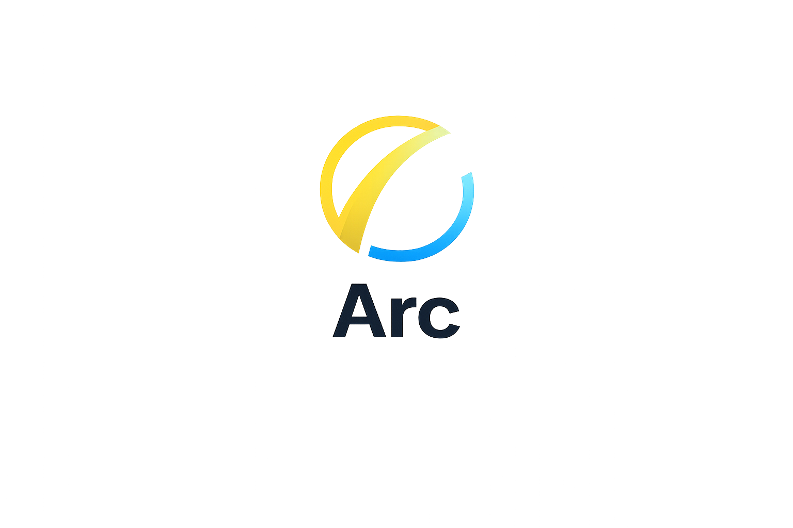
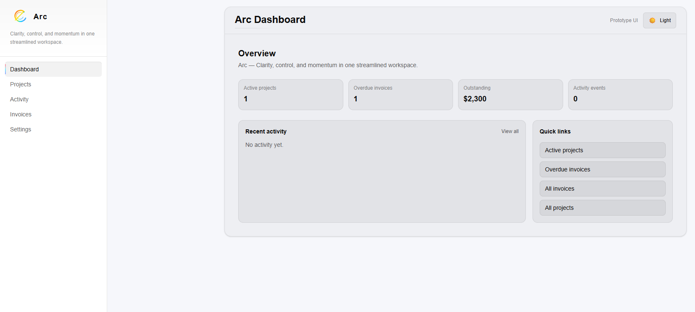
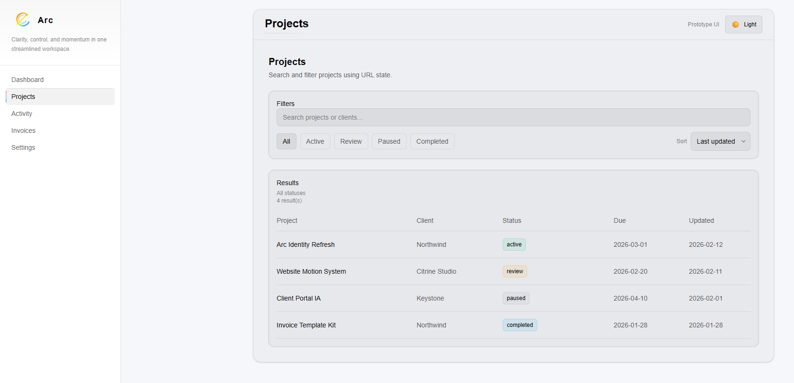
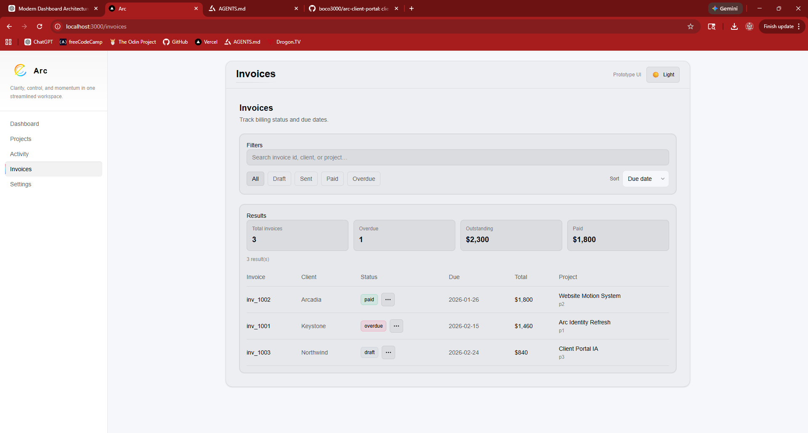

<p align="center">
  
</p>

<h1 align="center">Arc Dashboard</h1>

<p align="center">
  
</p>

<h1 align="center">Arc</h1>

<p align="center">
  <strong>Clarity, control, and momentum in one streamlined workspace.</strong>
</p>

<p align="center">
  Modern SaaS-style dashboard & client portal built with Next.js App Router, React, TypeScript, and Tailwind CSS.
</p>

<p align="center">
  
  
  
  
  
</p>

---

## ✦ Live Preview

```
https://arc-dashboard.vercel.app
```

---

## ✦ About Arc

**Arc** is a modern dashboard application created to demonstrate real product-style frontend architecture rather than traditional marketing pages.

This project focuses on:

* Structured application layouts
* Inline editing UX
* State-driven UI updates
* Design token–based theming
* Accessible interaction patterns
* Realistic SaaS workflows

Arc is intentionally frontend-focused and simulates backend behavior using centralized local state.

---

## ✦ Preview

<p align="center">
  
</p>

<p align="center">
  
</p>

<p align="center">
  
</p>

---

## ✦ Feature Highlights

### Dashboard

* KPI overview panels
* Recent activity timeline
* Quick navigation actions
* Light / Dark theme support

### Projects

* URL-driven search and filters
* Inline status editing
* Editable project metadata
* Activity logging

### Invoices

* Invoice creation workflow
* Editable line items
* Inline status controls
* Reminder actions with feedback

### Activity Feed

* Global event timeline
* Filterable system actions

### Settings

* Demo data reset
* LocalStorage-based state simulation

---

## ✦ UI Architecture

Arc uses a token-driven design system:

* Semantic surface tokens
* Theme-aware styling
* Consistent hover and focus behavior
* Accessible keyboard navigation

Key patterns:

* Server / Client component boundaries
* Optimistic updates
* Centralized PortalStateProvider
* Inline action menus
* Toast-based feedback system

---

## ✦ Tech Stack

* **Next.js (App Router)**
* **React**
* **TypeScript**
* **Tailwind CSS v4**
* **Framer Motion**
* **Design Tokens via CSS Variables**
* **Vercel Deployment**

---

## ✦ Getting Started

```bash
npm install
npm run dev
```

Open:

```
http://localhost:3000
```

---

## ✦ Folder Structure

```
src/
 ├─ app/
 │   ├─ (portal)/
 │   │   ├─ dashboard/
 │   │   ├─ projects/
 │   │   ├─ invoices/
 │   │   └─ activity/
 ├─ components/
 │   ├─ layout/
 │   ├─ portal/
 │   ├─ projects/
 │   ├─ invoices/
 │   └─ ui/
 ├─ data/
 ├─ lib/
```

---

## ✦ Deployment

1. Push repository to GitHub
2. Import project into **Vercel**
3. Framework preset: **Next.js**
4. Deploy

---

## ✦ Design Goals

* Minimal SaaS-style interface
* Clear information hierarchy
* Theme-aware design tokens
* Portfolio-ready architecture

---

## ✦ Future Enhancements

* Authentication layer
* Real database integration
* Analytics widgets
* Saved dashboard views
* Advanced filters

---

## ✦ Author

Built as part of an evolving frontend portfolio focused on modern React, Next.js, and scalable dashboard architecture.

